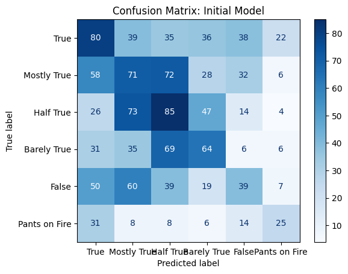
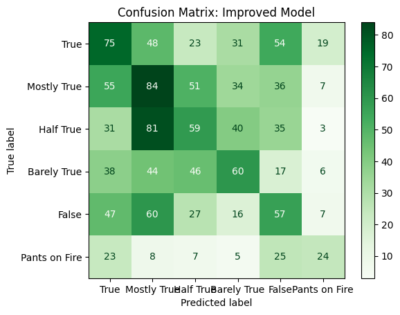
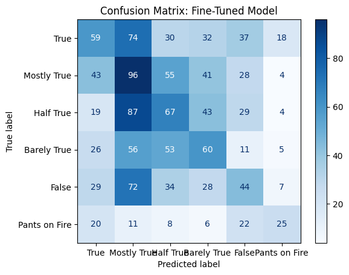

# Simplifying Fact-Checking with Transformers: A Study on the LIAR Dataset

## Overview
Fact-checking has become increasingly critical in combating misinformation. The LIAR dataset, a widely used benchmark for this task, categorizes statements into six nuanced labels:
- **True**
- **Mostly True**
- **Half True**
- **Barely True**
- **False**
- **Pants on Fire**

Each statement is accompanied by metadata, including:
- **Speaker**: The person who made the statement.
- **Affiliation**: The speaker's political or organizational ties.
- **Context**: The circumstances surrounding the statement.

This rich dataset presents both opportunities and challenges for building effective fact-checking models.

## Problem
Fact-checking presents several key challenges:
1. **Class Imbalance**: Categories like "Pants on Fire" are underrepresented, leading to biased predictions and lower accuracy for these labels.
2. **Ambiguous Labels**: Overlapping categories (e.g., "Mostly True" vs. "Half True") often confuse classification models.
3. **Dataset Limitations**: The relatively small size of the LIAR dataset restricts model generalization, especially for nuanced classifications.

## Approach
This project builds on prior research while emphasizing simplicity and practicality. Using state-of-the-art Transformer models, we explored three approaches:
1. **Baseline Model**:
   - Fine-tuned a pre-trained BERT model using only the statement text.
   - Established a reference point for further improvements.

2. **Improved Model**:
   - Enriched inputs with metadata (e.g., speaker, affiliation, context).
   - Applied weighted loss to address class imbalance and improve performance for underrepresented categories.

3. **Fine-Tuned Model**:
   - Optimized hyperparameters (e.g., learning rates, batch sizes) for more stable and effective training.
   - Experimented with extended epochs and gradient accumulation.

To demonstrate real-world applicability, the final model was deployed as an interactive Gradio app for real-time predictions.

## Background

### Introduction to the LIAR Dataset
The **LIAR** dataset, introduced in 2017 by William Yang Wang, is a benchmark for fake news classification. It contains:
- **12,836 short statements** labeled into six categories: *true, mostly true, half true, barely true, false, and pants on fire*.
- Metadata accompanying each statement, including:
  - **Speaker**: The person making the statement.
  - **Affiliation**: The speaker's political or organizational ties.
  - **Context**: The circumstances surrounding the statement.

This dataset provides a rich resource for training fact-checking models but poses unique challenges, such as label imbalance and overlapping class definitions.

### Challenges of Fact-Checking
1. **Imbalanced Data**: Labels like "pants on fire" are underrepresented, leading to biased model predictions.
2. **Ambiguous Labels**: Overlaps between categories (e.g., "half true" and "mostly true") make classification difficult.
3. **Small Dataset Size**: The limited amount of data constrains the ability of models to generalize effectively.

### Prior Work
#### The LIAR Dataset Paper (2017)
- Introduced the LIAR dataset as a benchmark for fake news detection.
- Tested traditional machine learning models like Logistic Regression and SVM.
- Achieved an F1 score of **~27.4%** on six-way classification, highlighting the task's difficulty.

#### LIAR-PLUS Dataset (2018)
- Enhanced the LIAR dataset with **justifications** (evidence from fact-checking articles).
- Showed that incorporating justifications improved F1 scores for six-way classification to **37%**.
- Utilized BiLSTM models with dual inputs (claims and justifications), outperforming single-input approaches.

#### Triple Branch Siamese Network (2019)
- Built a three-branch network using BERT to process statements, metadata, and justifications.
- Introduced a "credit score" derived from speaker history to quantify reliability.
- Achieved the highest six-way classification accuracy to date (**37.4%**) on LIAR-PLUS but noted limitations in metadata integration.

## Model

This project utilized three sequential approaches to model development, leveraging the LIAR dataset for classification into six labels: True, Mostly True, Half True, Barely True, False, and Pants on Fire.

### 1. Baseline Model
- **Description**: The baseline model fine-tuned `bert-base-uncased` using both statement text and enriched metadata:
  - **Speaker**
  - **Party affiliation**
  - **Context**
  These features were combined into a single input string separated by `[SEP]` tokens. This approach established a reference point for evaluating improvements.
- **Implementation**:
  - Used Hugging Face's `Trainer` API for fine-tuning.
  - Trained for 3 epochs with a learning rate of `2e-5`.
  - Evaluated performance based on weighted F1 score and accuracy.
- **Metrics**:
  - **Validation Loss**: 1.677
  - **Validation Accuracy**: 30.37%
  - **Validation F1**: 0.303
  - **Test Loss**: 1.640
  - **Test Accuracy**: 28.37%
  - **Test F1**: 0.282

### 2. Improved Model
- **Description**: The improved model addressed the class imbalance in the LIAR dataset by implementing a weighted loss function. The weights were inversely proportional to the frequency of each label, ensuring underrepresented classes like "Pants on Fire" contributed more to the loss calculation.
- **Implementation**:
  - Customized the Hugging Face `Trainer` to apply a weighted cross-entropy loss during training.
  - Used the same enriched inputs and training setup as the baseline model.
  - Trained for 3 epochs with the same learning rate (`2e-5`).
- **Metrics**:
  - **Validation Loss**: 1.994
  - **Validation Accuracy**: 28.04%
  - **Validation F1**: 0.282
  - **Test Loss**: 1.920
  - **Test Accuracy**: 27.98%
  - **Test F1**: 0.280
- **Insights**:
  - Weighted loss improved performance for underrepresented classes.
  - Overall accuracy and F1 scores remained comparable to the baseline, highlighting the need for additional improvements.

### 3. Fine-Tuned Model
- **Description**: The fine-tuned model focused on hyperparameter optimization to improve training stability and generalization:
  - Lowered the learning rate to `1e-5`.
  - Increased the number of epochs to 5.
  - Reduced batch size to 8 and used gradient accumulation to simulate a larger batch size.
  - Applied a higher weight decay for regularization.
- **Implementation**:
  - Used the same enriched input format as the baseline and improved models.
  - Trained using the Hugging Face `Trainer` with fine-tuned training arguments.
- **Metrics**:
  - **Validation Loss**: 2.728
  - **Validation Accuracy**: 27.02%
  - **Validation F1**: 0.271
  - **Test Loss**: 2.646
  - **Test Accuracy**: 27.36%
  - **Test F1**: 0.272
- **Insights**:
  - Hyperparameter optimization reduced overfitting but did not significantly improve metrics.
  - Highlighted the limitations of small datasets like LIAR for nuanced classification tasks.

### Model Comparison
| Model              | Validation Loss | Validation Accuracy (%) | Validation F1 | Test Loss | Test Accuracy (%) | Test F1   |
|--------------------|-----------------|--------------------------|---------------|-----------|-------------------|-----------|
| Baseline           | 1.677           | 30.37                   | 0.303         | 1.640     | 28.37            | 0.282     |
| Improved           | 1.994           | 28.04                   | 0.282         | 1.920     | 27.98            | 0.280     |
| Fine-Tuned         | 2.728           | 27.02                   | 0.271         | 2.646     | 27.36            | 0.272     |

### Key Takeaways
1. **Baseline Model**:
   - Achieved strong starting performance by incorporating enriched metadata in the input.
   - Demonstrated the potential of transformer models for fact-checking tasks.

2. **Improved Model**:
   - Addressed class imbalance using weighted loss, benefiting underrepresented classes.
   - Metrics remained similar to the baseline, indicating limited impact on overall performance.

3. **Fine-Tuned Model**:
   - Adjusted hyperparameters to balance overfitting risks but showed diminishing returns.
   - Reinforced the need for larger datasets or external justifications to enhance generalization.

4. **Challenges Persist**:
   - All models struggled with ambiguous labels and dataset imbalance, limiting their ability to achieve significant accuracy improvements.

### Confusion Matrices
Below are the confusion matrices for each model, providing a detailed view of classification performance. They highlight areas where the models performed well and where they struggled.

#### Baseline Model

#### Improved Model

#### Fine-Tuned Model

### Insights from Confusion Matrices
1. **Baseline Model**:
   - Performed best on common labels like "Mostly True" and "Half True."
   - Significant misclassification across adjacent categories like "Barely True" and "Half True."

2. **Improved Model**:
   - Weighted loss improved performance on "Pants on Fire" but introduced some misclassification in more frequent classes like "True."

3. **Fine-Tuned Model**:
   - Hyperparameter tuning balanced some performance but struggled to address dataset limitations, with confusion persisting between ambiguous labels.

## Critical Analysis

This project builds on prior work, simplifying workflows and leveraging state-of-the-art Transformers for fact-checking tasks. Below is a detailed analysis of the project's impact, insights, and comparisons with previous works.

### Impact of This Project

1. **Simplified Workflow**:
   - Unlike prior studies, this project excluded external justifications (e.g., LIAR-PLUS) and complex architectures (e.g., Siamese networks).
   - It demonstrated that fine-tuning a standard Transformer model (`bert-base-uncased`) can yield competitive results on the LIAR dataset, simplifying implementation while maintaining comparable performance.

2. **Practical Deployment**:
   - The development of a Gradio app makes the model accessible for real-world use, allowing users to input statements and receive classification predictions in real-time.
   - This bridges the gap between research and practical applications, empowering educators, journalists, and researchers to explore automated fact-checking.

3. **Benchmarking and Limitations**:
   - While achieving a test accuracy of 27.36% and an F1 score of 0.272, the project highlights challenges in multi-class classification, such as:
     - Class imbalance.
     - Overlapping and ambiguous labels.
     - The limited size of the LIAR dataset restricting generalization.

### Comparison with Previous Works

#### **Previous Work 1: Liar, Liar Pants on Fire!**
- **Models Used**: Baselines (Logistic Regression, SVM), CNN, Bi-LSTM, and hybrid models with metadata integration.
- **Key Results**:
  - CNN achieved 27.0% test accuracy (text-only).
  - Hybrid CNN with metadata improved to 27.4% test accuracy.
- **Insights**:
  - Metadata provided limited improvements due to shallow contextual modeling.

#### **Previous Work 2: Where is Your Evidence?**
- **Dataset**: Introduced LIAR-PLUS with human-extracted justifications.
- **Models Used**: Feature-based (LR, SVM) and neural models (Bi-LSTM, P-BiLSTM) with justification modeling.
- **Key Results**:
  - Best F1 score: 37% on test set (S+MJ condition with justifications).
  - Best accuracy: 35% on test set (six-way classification).
- **Insights**:
  - Justification modeling significantly improved performance.
  - Neural models performed comparably to feature-based approaches.

#### **Previous Work 3: Fake News Classification (LIAR-PLUS)**
- **Models Used**: Fine-tuned BERT and Triple Branch Siamese Network with metadata and credit scoring.
- **Key Results**:
  - Best six-way classification accuracy: 37.4%.
- **Insights**:
  - Metadata and credit scoring enhanced class separation.
  - Model complexity led to significant computational overhead.

### **This Project: Simplified Workflow with LIAR Dataset**

#### Differences from Previous Work:
1. **Focus on LIAR Dataset**:
   - Excluded external justifications and relied solely on metadata within the LIAR dataset.
   - Simplified implementation compared to works utilizing LIAR-PLUS or justification modeling.

2. **Transformer-Based Simplicity**:
   - Fine-tuned `bert-base-uncased` without complex architectures like Siamese networks or parallel modeling.

3. **Practical Deployment**:
   - Developed a Gradio app for real-time classification, demonstrating practical usability beyond academic experimentation.

#### Results Comparison:
| Study                     | Dataset     | Model                          | Test Accuracy (%) | 
|---------------------------|-------------|---------------------------------|-------------------|
| **Liar, Liar (2017)**      | LIAR        | CNN + Metadata                 | 27.4              | 
| **Where is Your Evidence** | LIAR-PLUS   | Bi-LSTM + Justification         | 35.0              |      
| **Fake News Classification** | LIAR-PLUS | Triple Siamese BERT            | 37.4              | 
| **This Project**           | LIAR        | Fine-Tuned BERT                | 27.36             | 

### Key Takeaways

1. **Simplified Metadata Integration**:
   - By combining speaker, party affiliation, and context as enriched text inputs, the project achieved comparable results to hybrid and justification-based models.

2. **Dataset Limitations**:
   - Results reinforce the challenges of small datasets like LIAR, which struggle with nuanced multi-class classification tasks.
   - External evidence or augmented datasets (e.g., LIAR-PLUS) remain crucial for significant performance gains.

3. **Workflow Accessibility**:
   - The project's simplified approach and interactive deployment prioritize reproducibility and practical usage, making it accessible to a broader audience.

### Future Directions

1. **Dataset Augmentation**:
   - Incorporate LIAR-PLUS justifications or other external evidence to improve label discrimination.
   - Expand the dataset to mitigate class imbalance and enhance generalization.

2. **Model Advancements**:
   - Experiment with advanced Transformer architectures (e.g., T5 or GPT) to handle multi-task objectives like classification and justification generation.
   - Investigate few-shot learning to overcome small dataset limitations.

3. **Explainability**:
   - Add interpretability tools to the Gradio app (e.g., attention visualizations) to increase user trust and provide insights into the model’s decision-making.

## References
1. **"Liar, Liar Pants on Fire": A New Benchmark Dataset for Fake News Detection**  
   *Author*: William Yang Wang  
   *Description*: This paper introduces the LIAR dataset, a benchmark for fake news classification, and evaluates baseline and hybrid models.  
   [Read the Paper](https://paperswithcode.com/paper/liar-liar-pants-on-fire-a-new-benchmark)

2. **Where is Your Evidence: Improving Fact-checking by Justification Modeling**  
   *Authors*: Tariq Alhindi, Savvas Petridis, Smaranda Muresan  
   *Description*: This paper introduces the LIAR-PLUS dataset, incorporating justifications to improve fact-checking tasks.  
   [Read the Paper](https://aclanthology.org/W18-5513/)

3. **Triple Branch BERT Siamese Network for Fake News Classification on LIAR-PLUS Dataset**  
   *Description*: Implements a triple-branch Siamese network architecture using BERT for improved fake news classification on the LIAR-PLUS dataset.  
   [Visit Repository](https://github.com/manideep2510/siamese-BERT-fake-news-detection-LIAR?tab=readme-ov-file)
